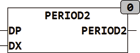

<!--
  Copyright (c) 2026 Hans Mühlbauer, Franz Höpfinger and others.

  This program and the accompanying materials are made available under the
  terms of the Eclipse Public License 2.0 which is available at
  https://www.eclipse.org/legal/epl-2.0

  SPDX-License-Identifier: EPL-2.0
-->

## PERIOD2

| | |
|:---|:---|
| **Type	Function** | BOOL |
| **Input	DP** | ARRAY [0..3,0..1]  of  DATE (periods) |
| **DX** | DATE (date to be tested) |
| **Output** | BOOL (TRUE if DX is within one of the periods) |
| | PERIOD2 check if the DX date within a specified period of 4 periods. The periods are in an array [0..3,0..1]  of  DATE specified. In contrast to the function PERIOD of PERIOD2 reviewes also the year. The periods are specified in ARRAY DP, where DP[N,0] is the beginning date of the period N, DP[N,1] N is the end date of period. |
| **The function test using the formula** | DX >= DP [N,0] AND DX <= DP [N,1]. In each case it is considered N = 0 to 3. If DX is one of the 4 periods, the output is set to TRUE. |
| | The individual periods need not be present sorted. PERIOD2 can be used to define holiday or vacation time. PERIOD2 reviews not  repeated periods, but tests yearly repeated periods. |

