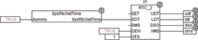

<!--
  Copyright (c) 2026 Hans Mühlbauer, Franz Höpfinger and others.

  This program and the accompanying materials are made available under the
  terms of the Eclipse Public License 2.0 which is available at
  https://www.eclipse.org/legal/epl-2.0

  SPDX-License-Identifier: EPL-2.0
-->

## RTC_2

| | |
|:---|:---|
| **Type** | Function module |
| **Input	SET** | BOOL (set input) |
| **[SDT](../Data Types/sdt.md)** | DT (set date and time) |
| **SMS** | INT (set Milliseconds) |
| **DEN** | BOOL (automatic daylight saving time ON) |
| **SFO** | INT (local time offset from UTC in minutes) |
| **Output	UDT** | DT (Date and time output for Universal Time) |
| **LDT** | DT (local time) |
| **DSO** | BOOL (summer active) |
| **XMS** | INT (milliseconds) |
| **RTC_2 is a clock component of the UTC and local time at the outputs of LDT and UDT provides. The time is automatically every time you SET = TRUE to the value of [SDT](../Data Types/sdt.md) and SMS. If SET = FALSE the time runs on and on and provides at the output UDT the current date and time for Universal Time (UTC), and at the output LDT the current local time. The output LDT corresponds UDT + OFS + summer time when it is current. Summer time is, if DEN = TRUE, automatically switched back on the last Sunday of March at 01** | 00 UTC (02:00 CET) to summer time (03:00 GMT) and on the last Sunday of October at 01:00 UTC (03:00 BST) on 02:00 CET. The output of DSO is TRUE if daylight saving time is. If DEN is FALSE, no summer time change is made. The accuracy of the clock depends on the millisecond  Timer  of the PLC. The input SFO specifies the time offset of LDT to UDT, for MEZ this value is 1 hour. SFO is specified as INT in minutes so that a negative offset is available. For CET (Central European Time, an offset is set to 60 minutes.) RTC_2 takes over the Power  Up  automatically applied to the [SDT](../Data Types/sdt.md) start time and date. The output of XMS passes the milliseconds and every second counts from 0 - 999 |
| | The following example when starting the system time is taken. |

