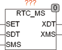

<!--
  Copyright (c) 2026 Hans Mühlbauer, Franz Höpfinger and others.

  This program and the accompanying materials are made available under the
  terms of the Eclipse Public License 2.0 which is available at
  https://www.eclipse.org/legal/epl-2.0

  SPDX-License-Identifier: EPL-2.0
-->

## RTC_MS

| | |
|:---|:---|
| **Type** | Function module |
| **Input	SET** | BOOL (set input) |
| **[SDT](../Data Types/sdt.md)** | DT (set date and time) |
| **SMS** | INT (set Milliseconds) |
| **Output	XDT** | DT (Date and Time Out) |
| **XMS** | INT (milliseconds output) |
| | RTC_MS is a clock component with a resolution of milliseconds and date. The time is automatically every time you SET = TRUE to the value of [SDT](../Data Types/sdt.md) and SMS. If SET = FALSE the time is running on their own and provides the output XDT the current date and time, and at the output XMS milliseconds. The output XMS counts  every second 0-999 and begins with the next second again at 0. The accuracy of the clock depends on the millisecond  Timer  of the PLC. |

