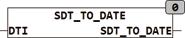

<!--
  Copyright (c) 2026 Hans Mühlbauer, Franz Höpfinger and others.

  This program and the accompanying materials are made available under the
  terms of the Eclipse Public License 2.0 which is available at
  https://www.eclipse.org/legal/epl-2.0

  SPDX-License-Identifier: EPL-2.0
-->

## Type	Function: DATE

| | |
|:---|:---|
| **Input	DTI** | [SDT](../Data Types/sdt.md) (structured input value as date / time value) |
| **Output** | DATE (Date value) |
| | SDT_TO_DATE produces a date value of a structured date-time value |

