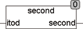

<!--
  Copyright (c) 2026 Hans Mühlbauer, Franz Höpfinger and others.

  This program and the accompanying materials are made available under the
  terms of the Eclipse Public License 2.0 which is available at
  https://www.eclipse.org/legal/epl-2.0

  SPDX-License-Identifier: EPL-2.0
-->

## Type	Function: REAL

| | |
|:---|:---|
| **Input	ITOD** | TOD (time of day) |
| **Output** | REAL (seconds and milliseconds of time of day) |
| | The function  SECOND  extracts the seconds portion of the day |



**Example:**

```iecst
SECOND(22:10:12.331) = 12.331
```
