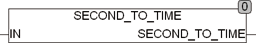

<!--
  Copyright (c) 2026 Hans Mühlbauer, Franz Höpfinger and others.

  This program and the accompanying materials are made available under the
  terms of the Eclipse Public License 2.0 which is available at
  https://www.eclipse.org/legal/epl-2.0

  SPDX-License-Identifier: EPL-2.0
-->

## Type	Function: TIME

| | |
|:---|:---|
| **Input	IN** | REAL (number of seconds with decimals) |
| **Output** | TIME (TIME) |
| | The function SECOND_TO_TIME calculates a value (TIME) from the input value in seconds as a REAL. |



**Example:**

```iecst
SECOND_TO_TIME(63.123) = T#1m3s123ms
```
