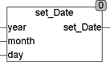

<!--
  Copyright (c) 2026 Hans Mühlbauer, Franz Höpfinger and others.

  This program and the accompanying materials are made available under the
  terms of the Eclipse Public License 2.0 which is available at
  https://www.eclipse.org/legal/epl-2.0

  SPDX-License-Identifier: EPL-2.0
-->

## Type	Function: DATE

| | |
|:---|:---|
| **Input	YEAR** | INT (year) |
| **MONTH** | INT (month) |
| **DAY** | INT (day) |
| **Output** | DATE (Composite date) |
| | The function SET_DATE calculates a Date (DATE) from the input values, day, month and year.  SET_DATE does not test the validity of a date. For example, also be February, 30th will be set, which, of course results the 1st March or in a leap year, the March, 2nd. SET_DATE can therefore also be used to generate any day of the year. This can be a quite practicable application. In this case, the monthly amount may also be 0. An invalid month always gives a date in relation to January. An invalid month (month < 1 or month > 12) is always interpreted as January. |



**Example:**

```iecst
SET_DATE(2007,1,365) = 31.12.2007
```

Example:	SET_DATE(2007, 1, 22) = 22.1.2007
