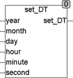

<!--
  Copyright (c) 2026 Hans Mühlbauer, Franz Höpfinger and others.

  This program and the accompanying materials are made available under the
  terms of the Eclipse Public License 2.0 which is available at
  https://www.eclipse.org/legal/epl-2.0

  SPDX-License-Identifier: EPL-2.0
-->

## Type	Function: DATE_TIME

| | |
|:---|:---|
| **Input	YEAR** | INT (year) |
| **MONTH** | INT (month) |
| **DAY** | INT (day) |
| **HOUR** | INT (hour) |
| **MINUTE** | INT (min) |
| **SECOND** | INT (seconds) |
| **Output** | DATE_TIME (Composite time date) |
| | The function SET_DT calculates a time-date value (DATE_TIME) from the input values, day, month, year, hour, minute and seconds. |



**Example:**

```iecst
Set_DT(2007, 1, 22, 13, 10, 22) = DT#2007-1-22-13:10:22
```
