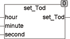

<!--
  Copyright (c) 2026 Hans Mühlbauer, Franz Höpfinger and others.

  This program and the accompanying materials are made available under the
  terms of the Eclipse Public License 2.0 which is available at
  https://www.eclipse.org/legal/epl-2.0

  SPDX-License-Identifier: EPL-2.0
-->

## Type	Function: TOD

| | |
|:---|:---|
| **Input	HOUR** | INT (hour) |
| **MINUTE** | INT (min) |
| **SECOND** | REAL (seconds and milliseconds) |
| **Output** | TOD (output value day) |
| | The function SET_TOD calculates a time of day (TOD) from the input values, hours, minutes and seconds. |



**Example:**

```iecst
Set_TOD(13, 10, 22.33) = 13:10:22.330
```
