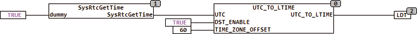

<!--
  Copyright (c) 2026 Hans Mühlbauer, Franz Höpfinger and others.

  This program and the accompanying materials are made available under the
  terms of the Eclipse Public License 2.0 which is available at
  https://www.eclipse.org/legal/epl-2.0

  SPDX-License-Identifier: EPL-2.0
-->

## Type	Function module

| | |
|:---|:---|
| **Input	UTC** | DATE_TIME (Universal Time) |
| **DST_ENABLE** | BOOL(TRUE allows DST) |
| **TIME_ZONE_OFFSET** | INT(time difference to UTC in minutes) |
| **Output	DT** | DATE_TIME (local time) |
| | The function module UTC_TO_LTIME calculates from the universal time at input UTC the local time (LOCAL_DT), with automatic daylight saving time if DST_ENABLE is set to True. If DST_ENABLE is FALSE, the local time is calculated without daylight saving. |
| | This function module requires  UTC at the input, which is normally provided by the PLC and can be read by a routine of the manufacturer. |
| | The following example an application for a WAGO 750-841 CPU is shown. The reading of the internal clock is done by the manufacturer SYSRTCGETTIME routine. The PLC clock must be in this case set to UTC. |

