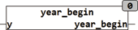

<!--
  Copyright (c) 2026 Hans Mühlbauer, Franz Höpfinger and others.

  This program and the accompanying materials are made available under the
  terms of the Eclipse Public License 2.0 which is available at
  https://www.eclipse.org/legal/epl-2.0

  SPDX-License-Identifier: EPL-2.0
-->

## Type	Function: DATE

| | |
|:---|:---|
| **Input	Y** | INT (year) |
| **Output** | DATE (date of 1 January of the year) |
| | YEAR_BEGIN calculate the date of the first January for the year Y. |

